# Fluent Audio Split

A web app for **audio stem separation**. You build a visual **DAG (directed acyclic graph) workflow** —
chaining ML models to progressively split an audio file into stems (vocals, drums, bass, …) — then run it
and watch progress stream in real time. Separation is powered by
[python-audio-separator](https://github.com/nomadkaraoke/python-audio-separator).

> **Audience of this README:** the maintainer. It is a *technical* map of what exists today, how the pieces
> fit, and — importantly — **where the project is and isn't robust** (see [Robustness](#robustness--known-limitations)).
> Per-subsystem detail lives in the sub-READMEs linked at the bottom.

---

## Screens

| Workflow canvas + live execution overlay | Per-node model browser |
|---|---|
|  |  |

| Dashboard | Execution detail (stem downloads) |
|---|---|
| 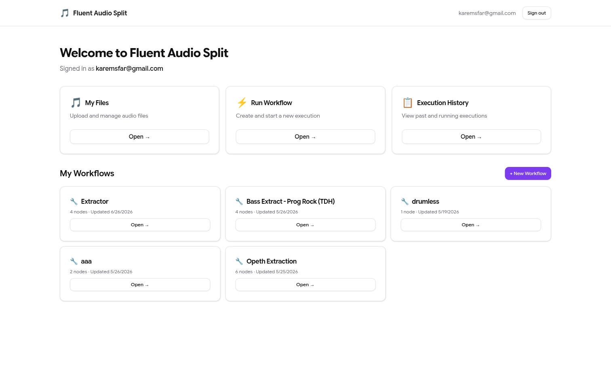 | 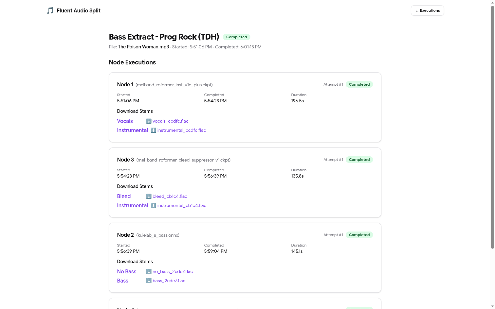 |

<details>
<summary>More screens (login, files, execution history)</summary>

| Login | Files | Execution history |
|---|---|---|
| 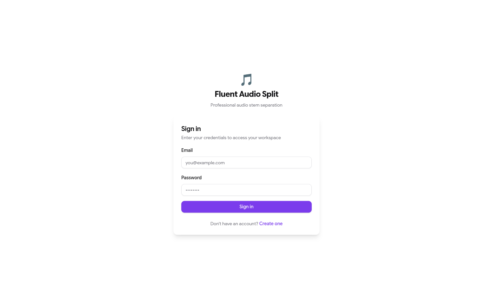 | 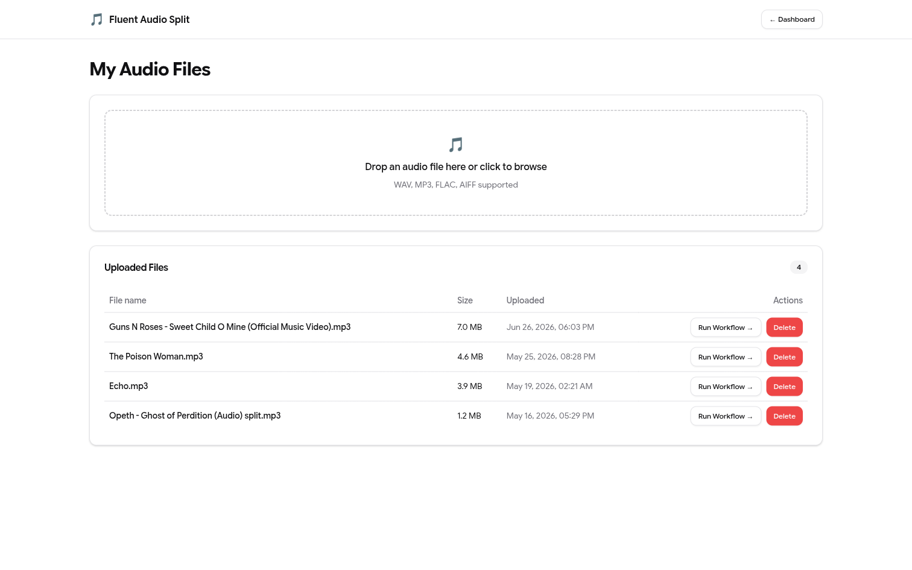 | 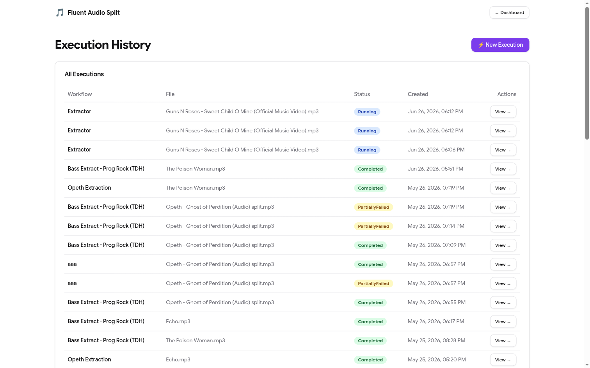 |

</details>

---

## System architecture

Everything runs under one Docker Compose network. An **nginx `gateway`** is the single published entry point
(`:8765`); it serves the built SPA and reverse-proxies `/api/*` to the ASP.NET API. The API and the Python
worker communicate **only** through RabbitMQ and a **shared volume** for audio files — they never call each
other directly.

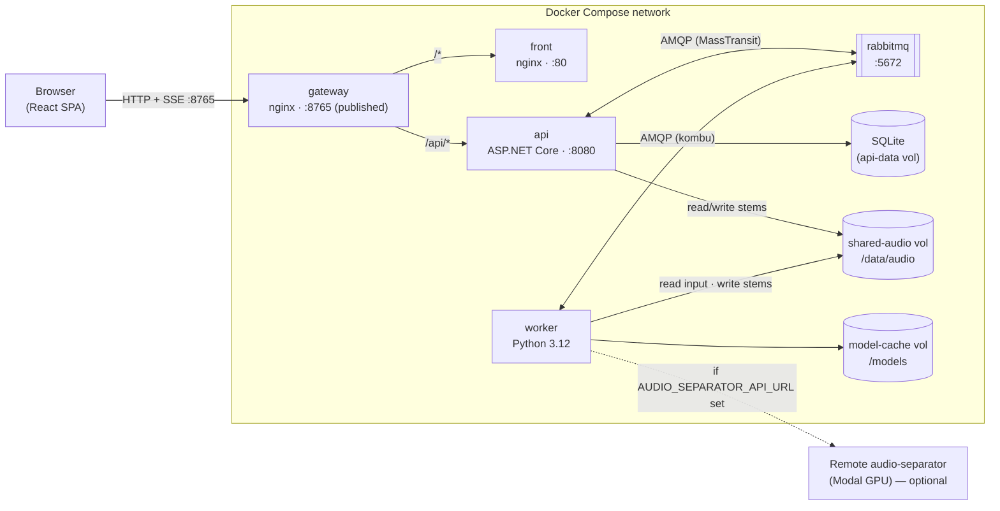

| Service | Image / build | Port | Role |
|---|---|---|---|
| `gateway` | `nginx:alpine` | **8765 → 80** (only published port) | Reverse proxy: `/`→front, `/api/`→api |
| `front` | `./src/front` | 80 (internal) | Built React SPA served by nginx |
| `api` | `./src/main-api` | 8080 (internal) | REST + SSE, EF Core, MassTransit |
| `worker` | `./src/audio-separation-worker` | — | Consumes jobs, runs separation |
| `rabbitmq` | `rabbitmq:3.13-management-alpine` | 5672 (internal) | Message broker |

> ⚠️ Unlike what older docs implied, **only `:8765` is published**. The RabbitMQ management UI (`15672`) and
> the API's Swagger UI are **not** reachable through the gateway — Swagger is only available when you run the
> API directly in local dev (`http://localhost:8080/swagger`). `GET :8765/swagger` returns the SPA's
> `index.html` (nginx `/` fallback), not Swagger.

---

## Core concepts

### Workflow = a DAG of separation nodes

A **Workflow** is a directed acyclic graph. Each **node** is one `AudioSeparation` operation: run **one model**
(or an ensemble) on **one audio input** and emit named **stems**. Nodes are wired by stem:

- The **root node** (`sourceNodeId = null`) takes the user's uploaded file.
- Every other node declares a **source node + source output name** (a stem of the parent), e.g. *"take the
  `Vocals` stem of Node 1 and run it through a karaoke model"*.
- Each node has **exactly one input**; a node may feed **many** children (fan-out).

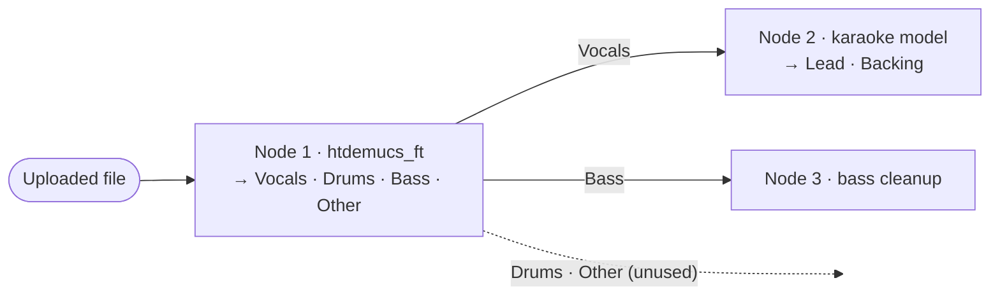

### Versioning: workflows are immutable per run

The graph is **not** stored as relational rows. Each save serializes the node list to JSON in a new
`WorkflowVersion.StructureJson`. An execution **pins the version it ran** (`WorkflowExecution.WorkflowVersionId`),
so editing a workflow never mutates a past run.

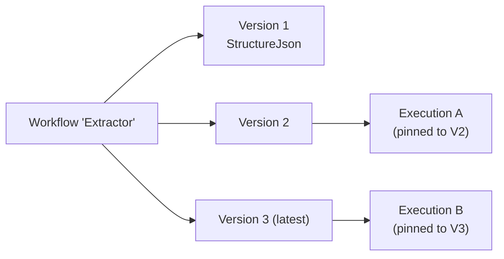

`StructureJson` is an array of `WorkflowNodeDefinition`:

```jsonc
[
  { "id": "<guid>", "order": 0, "nodeType": "AudioSeparation",
    "configJson": "{\"modelName\":\"htdemucs_ft.yaml\"}",
    "sourceNodeId": null, "sourceOutputName": null },
  { "id": "<guid>", "order": 1, "nodeType": "AudioSeparation",
    "configJson": "{\"modelName\":\"UVR-MDX-NET-Inst_HQ_3.onnx\"}",
    "sourceNodeId": "<node-0-guid>", "sourceOutputName": "Vocals" }
]
```

### The model→stems registry

The mapping of *model filename → stems it produces* exists in **three** places:

| Location | Form | Used for |
|---|---|---|
| `src/front/src/lib/models.ts` | `MODEL_DEFINITIONS` (150+ models, categories, ensemble presets) | Model browser UI, stem handles |
| `src/main-api/.../Domain/Models/StemDefinitions.cs` | `ModelStems` | API-side stem awareness |
| `src/audio-separation-worker/app/model_registry.json` | per-model `stems` + `stem_map` | Worker output naming — **single source of truth for the worker**, generated offline by actually resolving each model's real audio-separator SDK-internal stem name(s) (see `build_model_registry.py` in the separate `audio-sep` exploration repo), not hand-written |

> ⚠️ `models.ts`/`StemDefinitions.cs` are still maintained by hand and can drift from each other (the TS list is
> far larger — see [Robustness](#robustness--known-limitations)). The worker no longer trusts either at
> runtime, though: it looks up `model_registry.json` by model filename and **fails the node with no fallback**
> if a model is missing or not yet resolved there, instead of guessing stems from `configJson`.

---

## Execution flow (end to end)

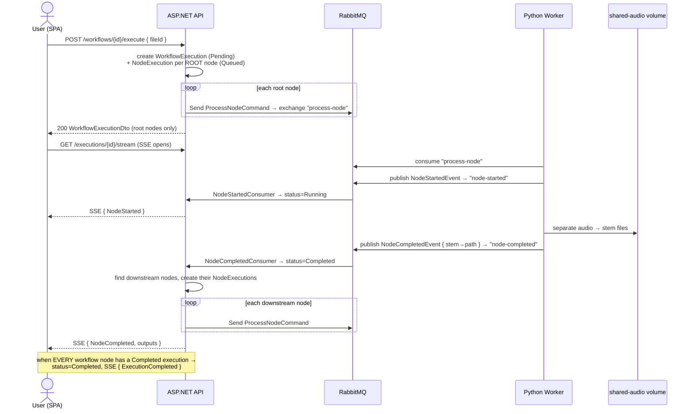

Key consequence of this design: **only root `NodeExecution` rows exist up front**; downstream rows are created
*lazily* by the `NodeCompletedConsumer` as parents finish. This shaped several frontend bugs (now fixed on the
`execution_in_main_ui` branch) — see the Serena memory `frontend/execution_overlay` and `TODO.md`.

### Messaging topology (RabbitMQ)

Both sides use **fanout exchanges** named after the message. MassTransit (C#) and kombu (Python) interoperate by
agreeing on the **MassTransit JSON envelope** (`messageType` URN + `message` body).

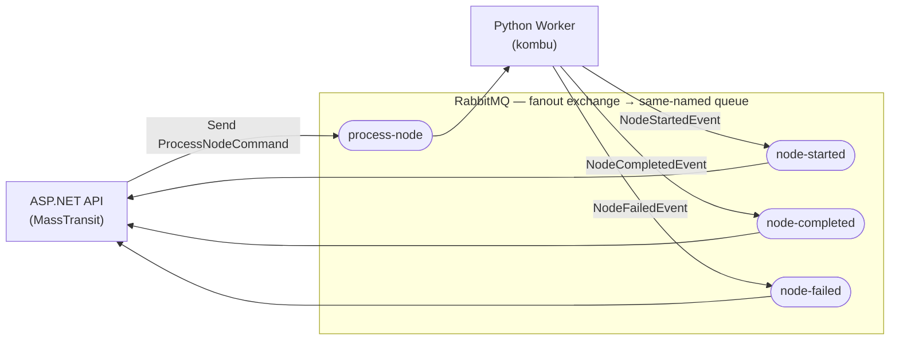

| Message | Direction | Payload |
|---|---|---|
| `ProcessNodeCommand` | API → worker | `workflowExecutionId, nodeExecutionId, nodeType, inputArtifactPath, outputArtifactDir, configJson` |
| `NodeStartedEvent` | worker → API | `workflowExecutionId, nodeExecutionId` |
| `NodeCompletedEvent` | worker → API | `workflowExecutionId, nodeExecutionId, outputArtifactPaths {stem→relPath}` |
| `NodeFailedEvent` | worker → API | `workflowExecutionId, nodeExecutionId, errorMessage, isTransient` |

The browser never touches RabbitMQ. The API re-broadcasts events to the SPA over **SSE**
(`GET /api/executions/{id}/stream`) via an in-memory `ExecutionEventBus` (no replay/snapshot — late subscribers
miss prior events).

### Worker pipeline & local-vs-remote separation

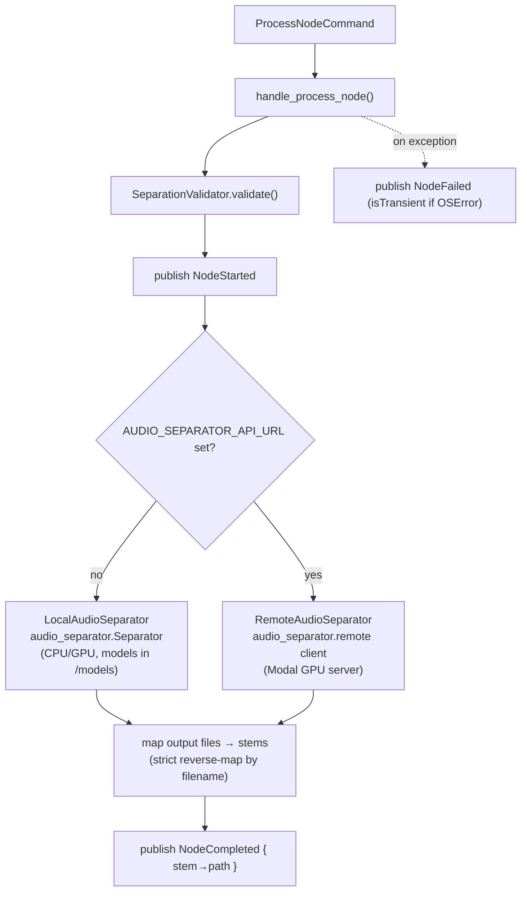

Output filenames are deterministic: `{stem_normalized}_{nodeExecId[:5]}` (e.g. `vocals_ccdfc.flac`), so the
worker can strictly match produced files back to canonical stem names. Per-node **advanced params**
(`output_format`, arch-specific knobs for MDX / VR / Demucs / MDXC, ensemble model lists + blend algorithm) flow
from the UI through `configJson.advancedParams` into the separator.

---

## Data model

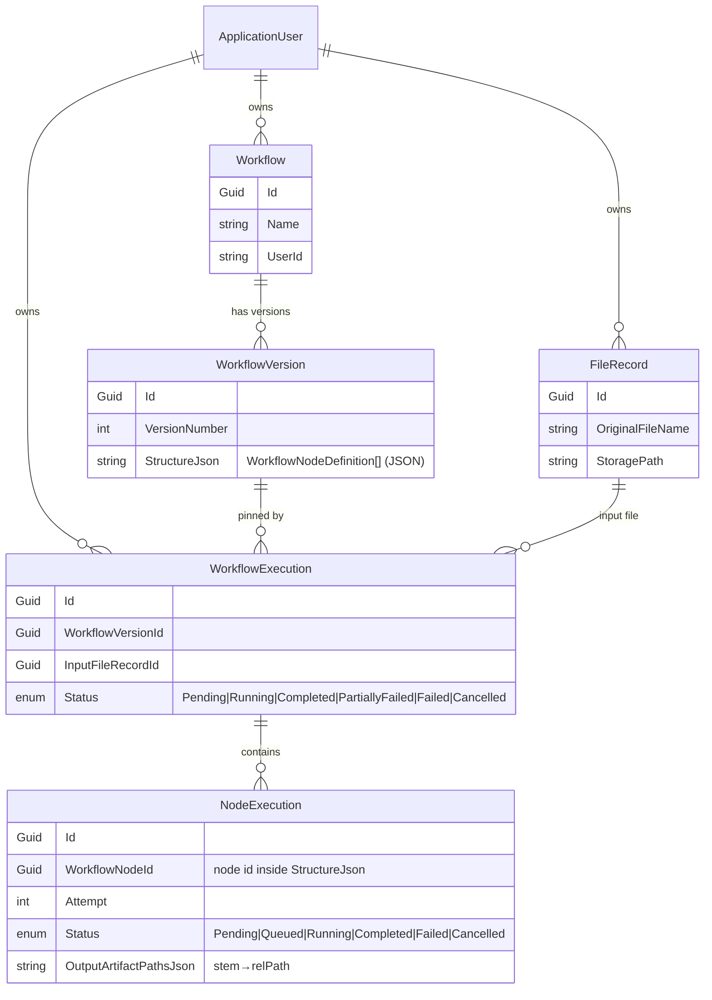

`NodeExecution.WorkflowNodeId` references a node **inside the version's `StructureJson`** — there is no FK to a
node row (nodes aren't rows). A retry creates a **new** `NodeExecution` (new id, `Attempt+1`) for the same
`WorkflowNodeId`.

### Status lifecycles

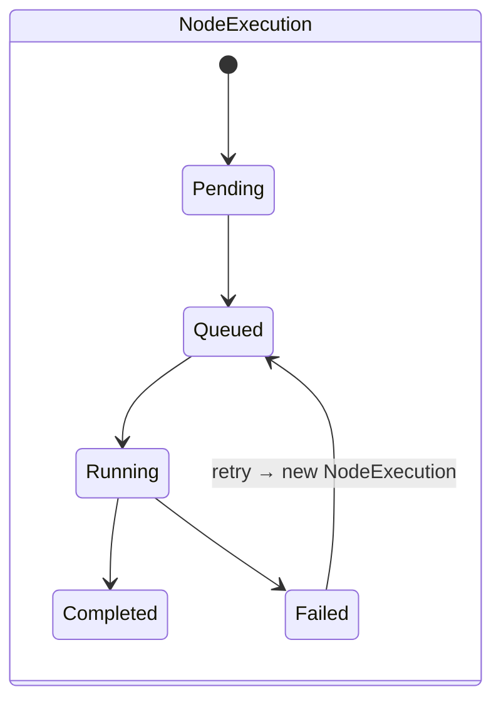

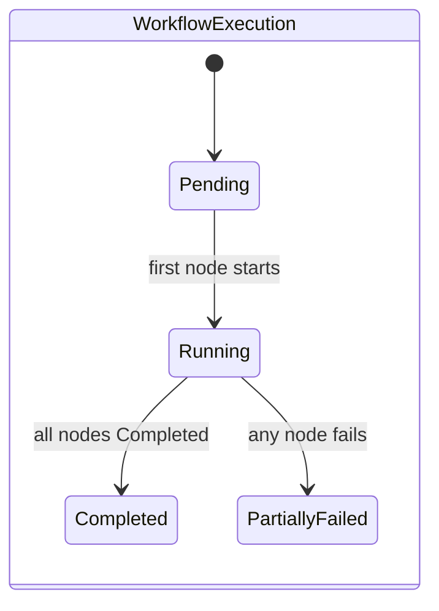

> `Failed` and `Cancelled` are **defined but never set** today, and `PartiallyFailed` is **never upgraded** back
> to `Completed` even if remaining branches finish (see [Robustness](#robustness--known-limitations)).

---

## Frontend route map

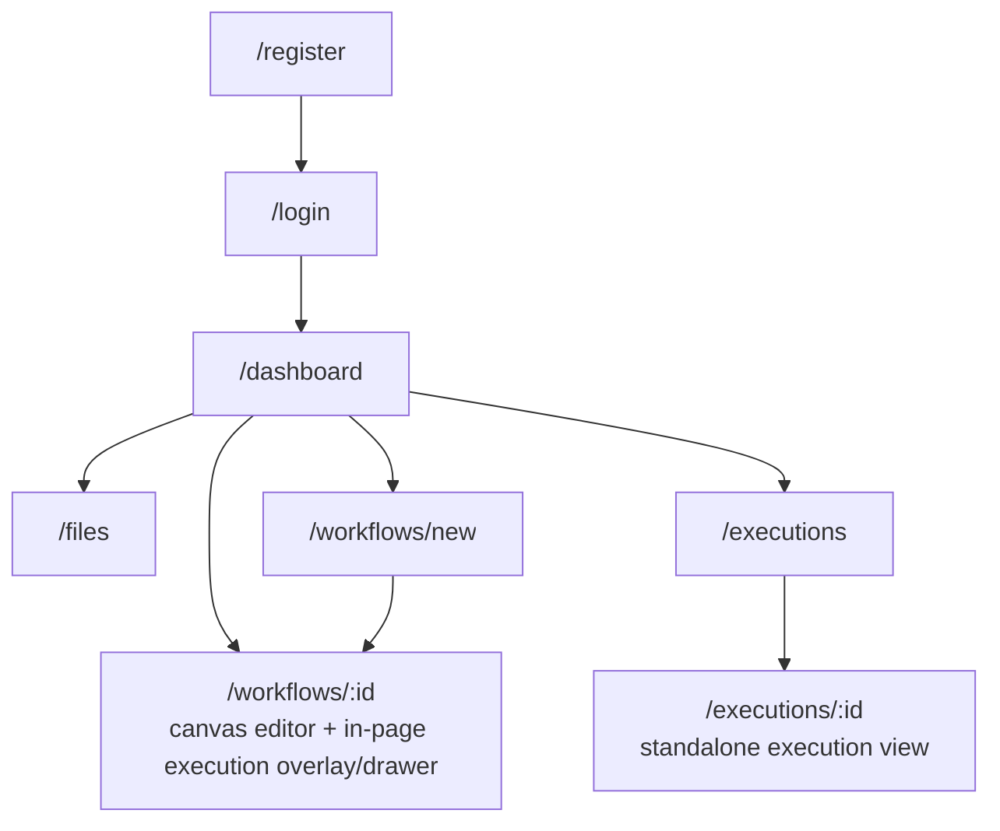

- **Canvas (`/workflows/:id`)** — React Flow DAG editor. As of the `execution_in_main_ui` branch it also hosts
  the live execution: node status overlays, an `ExecutionDrawer`, and per-node run/retry buttons, streamed over SSE.
- **Execution page (`/executions/:id`)** — the older standalone view (node cards + stem downloads), still used
  from the history list.

State: **TanStack Query** for server data; **local `useState`** for live execution state fed by the SSE hook
(`hooks/useExecutionStream.ts`). Auth tokens live in `localStorage` (`auth_token` / `auth_refresh_token`).

---

## Tech stack

| Layer | Technology |
|---|---|
| Frontend | React 19, TypeScript, Vite, React Flow (`@xyflow/react`), Tailwind + shadcn/ui, TanStack Query, `@microsoft/fetch-event-source` |
| API | ASP.NET Core (.NET 10), ASP.NET Identity (bearer tokens), EF Core, MassTransit |
| Worker | Python 3.12, kombu, `audio-separator` |
| Broker | RabbitMQ 3.13 |
| Database | SQLite (dev; auto-migrated on startup) |
| Gateway | nginx |
| Observability | OpenTelemetry wired (tracing + metrics) — **exporters commented out** |

---

## Quick start (Docker)

```bash
cp .env.example .env          # optional: set AUDIO_SEPARATOR_API_URL/KEY for remote GPU
docker compose up --build
```

Then open **http://localhost:8765**. Register an account, upload an audio file on **Files**, build a workflow
on the **canvas**, and hit **Execute**.

> First run downloads ML models into the `model-cache` volume (can be slow). Set `AUDIO_SEPARATOR_API_URL` to
> offload separation to a remote GPU (see `src/modal-deploy`).

### YouTube audio import

The **Run Workflow** dialog can also import a single YouTube video URL. The API downloads the selected video's
audio directly with `yt-dlp`, converts it to MP3 with `ffmpeg`, stores it as the signed-in user's normal input
file, then opens the existing waveform and trim controls. The browser never downloads from YouTube directly.

- The API container needs outbound HTTPS access to YouTube and its media/CDN hosts. Datacenter/VPS IP ranges are
  frequently challenged, throttled, or silently blocked by YouTube, so a residential/trusted egress proxy is the
  most reliable option in production. Set `YouTubeAudioImport__ProxyUrl` (for example a home proxy reachable over a
  tailnet, `http://<host>:3128`) to route both extraction and media download through it. Leave it empty to connect
  directly, which is fine for local development on a residential connection. The optional
  `docker-compose.youtube-proxy.yml` overlay sets this for you; start production with
  `docker compose -f docker-compose.yml -f docker-compose.youtube-proxy.yml up -d --build`.
- Imports are synchronous in this release and time out after five minutes by default. The default maximum MP3 size
  is 1 GiB. These limits are configurable with `YouTubeAudioImport__TimeoutSeconds` and
  `YouTubeAudioImport__MaximumFileSizeBytes`.
- The API image includes checksum-verified `yt-dlp` 2026.07.04, `ffmpeg`, and Deno for yt-dlp's required
  JavaScript challenge runtime, plus `curl-cffi` for Chrome TLS/browser impersonation. Rebuild with newer pinned
  downloader dependencies when YouTube changes its delivery behavior.
- On a datacenter IP, YouTube may return a “Sign in to confirm you're not a bot” challenge at extraction time or
  drop the media download from its CDN even after a signed URL is issued. Routing through a residential egress with
  `YouTubeAudioImport__ProxyUrl` is the dependable remedy. Keep import volume low and use only media you are
  authorized to use.
- Only import media you are authorized to download and process.

### Local development (without Docker)

```bash
# API  → http://localhost:8080  (Swagger at /swagger)
cd src/main-api
dotnet run --project FluentAudioSplit.Api --launch-profile http   # auto-applies migrations

# Frontend → http://localhost:5173
cd src/front && npm install && npm run dev                         # VITE_SERVICE_URL=http://localhost:8080

# Worker (needs a running RabbitMQ)
cd src/audio-separation-worker && pip install -r requirements.txt
RABBITMQ_HOST=localhost python -m app.consumer
```

---

## API surface

All routes require `Authorization: Bearer <token>` except the auth endpoints. Auth is **ASP.NET Identity**'s
built-in API (`MapIdentityApi`) mounted at `/api/auth` — there is no custom auth controller.

| Area | Endpoints |
|---|---|
| **Auth** | `POST /api/auth/register`, `POST /api/auth/login`, `POST /api/auth/refresh` (Identity) |
| **Files** | `POST /api/files/upload` · `POST /api/files/import-youtube` · `GET /api/files` · `GET /api/files/{id}/content` · `GET /api/files/download?path=` · `DELETE /api/files/{id}` |
| **Workflows** | `POST /api/workflows` · `GET /api/workflows` · `GET /api/workflows/{id}` · `PATCH /api/workflows/{id}` · `DELETE /api/workflows/{id}` · `POST /api/workflows/{id}/execute` |
| **Executions** | `GET /api/executions` · `GET /api/executions/{id}` · `GET /api/executions/{id}/stream` (SSE) · `GET /api/executions/{id}/results` · `POST /api/executions/{id}/nodes/{nodeExecId}/retry` |
| **Models** | `GET /api/models` |

---

## Repository layout

```
.
├── docker-compose.yml          # 5 services; only gateway publishes a port (8765)
├── nginx.conf                  # gateway: /→front, /api/→api
├── README.md                   # ← you are here
├── TODO.md                     # open follow-ups / known issues
├── docs/screenshots/           # images used in this README
└── src/
    ├── front/                  # React SPA            → src/front/README.md
    ├── main-api/               # ASP.NET Core API     → src/main-api/README.md
    ├── audio-separation-worker/# Python worker        → src/audio-separation-worker/README.md
    └── modal-deploy/           # deploy audio-separator on Modal (remote GPU)
```

---

## Robustness — known limitations

This is a **working prototype**, not a hardened product. Being candid about where it's thin (most items have
detail + fixes in [`TODO.md`](TODO.md)):

**Correctness / execution engine**
- **`PartiallyFailed` is a dead-end.** It's set on the first node failure and is treated as terminal by the
  client; on **branched** graphs that freezes still-running sibling branches, and it is **never** upgraded to
  `Completed`. `Failed`/`Cancelled` execution states exist in the enum but are never set, and there is **no
  cancel** endpoint.
- **At-least-once delivery, limited idempotency.** MassTransit has no inbox/outbox; a duplicate `NodeCompleted`
  guard was added, but there's no DB uniqueness on `(execution, node, attempt)`, so redelivery/retries can still
  spawn duplicate downstream work.
- **`isTransient` is computed but unused** — there is no automatic retry/backoff; failed nodes only retry on a
  manual user click.
- **Version drift:** the canvas always renders the *latest* version while an execution is pinned to the version
  it started on; editing + saving mid-run mismatches overlays, and the execution DTO doesn't expose
  `WorkflowVersionId` to detect it.

**Realtime / SSE**
- `ExecutionEventBus` is in-memory with **no replay/snapshot** — a page (re)loaded mid-run, or a reconnect, can
  miss events. The gateway also lacks `proxy_read_timeout`/`proxy_http_version 1.1` tuning for long-lived streams.

**Data / model registry**
- The model→stems registry is **duplicated across TS / C# / Python** and kept in sync by hand; they have already
  drifted (TS has 150+ models, the others far fewer).
- **SQLite single file**, migrations auto-applied on boot. Fine for dev, not for concurrent/prod use.

**Security / ops**
- **CORS is wide open** (`SetIsOriginAllowed(_ => true)`) and RabbitMQ uses `guest/guest`.
- **`GET /api/files/download?path=`** authorizes by `path.StartsWith(OutputArtifactDir)` on a **relative path
  without normalizing `..`** — worth hardening against path traversal.
- Bearer tokens expire in 5 min with a 14-day refresh token; the SPA's refresh wiring is partial.

**Testing / observability**
- **No automated tests** anywhere (no API/worker/frontend test suites).
- OpenTelemetry is wired but **all exporters are commented out** — nothing is actually exported yet.

See **[`TODO.md`](TODO.md)** for prioritized, file-referenced follow-ups.

---

## Status

- [x] Auth (register / login / bearer + refresh)
- [x] File upload / list / download / delete
- [x] Synchronous YouTube URL → MP3 import into the normal file and waveform flow
- [x] Workflow CRUD + multi-node DAG canvas editor (React Flow)
- [x] Multi-model separation (Demucs / MDX / MDXC·Roformer / VR), ensembles, advanced params
- [x] Stem-chaining (a node's stem becomes a downstream node's input)
- [x] Real-time progress via SSE; in-canvas execution overlay + drawer
- [x] Manual per-node retry
- [x] Local **or** remote (Modal GPU) separation
- [x] Docker Compose full stack behind an nginx gateway
- [ ] Robust failure/cancel semantics, tests, registry single-source-of-truth (see `TODO.md`)
```
