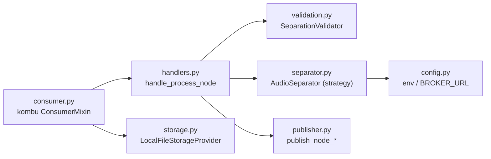
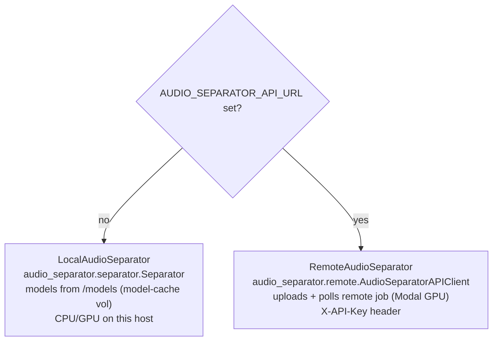

# audio-separation-worker — Python worker

Consumes `ProcessNodeCommand` jobs from RabbitMQ, runs stem separation (locally or via a remote GPU API), and
publishes `NodeStarted` / `NodeCompleted` / `NodeFailed` events back. Python 3.12, kombu,
[`audio-separator`](https://github.com/nomadkaraoke/python-audio-separator).

> The broker topology and message envelope are described in the [root README](../../README.md). This file is
> worker-internal detail.

## Module map



| File | Responsibility |
|---|---|
| `consumer.py` | Binds the `process-node` fanout queue, unwraps the MassTransit envelope, dispatches by message type |
| `handlers.py` | `handle_process_node` → `_handle_audio_separation`: orchestrates validate → start → separate → map → complete |
| `separator.py` | `AudioSeparator` strategy: `LocalAudioSeparator` vs `RemoteAudioSeparator`, chosen by env |
| `publisher.py` | Builds MassTransit-compatible envelopes and publishes node lifecycle events |
| `validation.py` | `SeparationValidator` — sanity-checks model/stems/params before running |
| `storage.py` | Relative ↔ absolute path resolution on the shared volume |
| `models.py` | `MODEL_STEMS` registry (must mirror the C# / TS copies) |
| `config.py` | Env: `RABBITMQ_*`, `SHARED_DATA_PATH`, `AUDIO_SEPARATOR_MODEL_DIR`, `AUDIO_SEPARATOR_API_URL/KEY` |

## Message handling

```mermaid
sequenceDiagram
  participant MQ as RabbitMQ
  participant C as consumer.py
  participant H as handlers.py
  participant S as separator.py
  participant P as publisher.py

  MQ->>C: envelope (process-node)
  C->>C: unwrap messageType URN + message
  C->>H: handle_process_node(payload, storage)
  H->>H: validate; build output_names {stem: "{stem}_{execId[:5]}"}
  H->>P: publish_node_started
  H->>S: separate(input, outDir, model, output_names, ensemble?, advancedParams?)
  S-->>H: list[output file paths]
  H->>H: strict reverse-map filename → canonical stem
  alt success
    H->>P: publish_node_completed { stem: relPath }
  else exception
    H->>P: publish_node_failed (isTransient = isinstance(e, OSError))
  end
  C->>MQ: ack (or reject on unhandled error)
```

- The consumer **acks** after the handler returns and **rejects** on an unhandled exception. The handler itself
  catches separation errors and turns them into a `NodeFailed` event (so a failed node is reported, not dropped).
- **Output naming is deterministic:** `{normalized_stem}_{nodeExecId[:5]}` (spaces/hyphens → `_`, lowercased).
  A strict `filename → stem` reverse map recovers canonical stem names; files that don't match are logged and
  dropped from the output map.
- **`configJson`** (from the node) drives behavior: `modelName` (required), `stems`, `ensembleEnabled` +
  `ensembleModels` + `ensembleMethod`, and `advancedParams`.

## Local vs remote separation

`create_audio_separator()` returns `RemoteAudioSeparator` iff `AUDIO_SEPARATOR_API_URL` is set, else
`LocalAudioSeparator`.



`advancedParams` are split into the SDK's arch-specific dicts (`mdx_params`, `vr_params`, `demucs_params`,
`mdxc_params`) plus common keys (`output_format`, `sample_rate`, …). For multiple models the SDK runs an
**ensemble** with `ensemble_algorithm` (e.g. `avg_wave`).

## Run

```bash
pip install -r requirements.txt
RABBITMQ_HOST=localhost python -m app.consumer       # needs a running RabbitMQ
```

In Docker the entrypoint runs the consumer with `RABBITMQ_HOST=rabbitmq` and the shared `/data/audio` +
`/models` volumes. (`run_consumer.py` is the container entrypoint; `celery.py`/`tasks.py` are legacy/unused —
the active path is the kombu `consumer.py`.)

## ⚠️ Registry sync

`app/models.py` (`MODEL_STEMS`) must agree with `src/main-api/.../StemDefinitions.cs` and
`src/front/src/lib/models.ts`. They are maintained by hand and currently **drift** — see the root README's
Robustness section and `../../TODO.md`.
