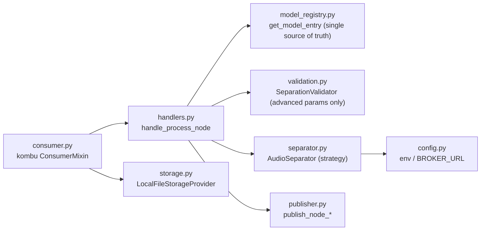
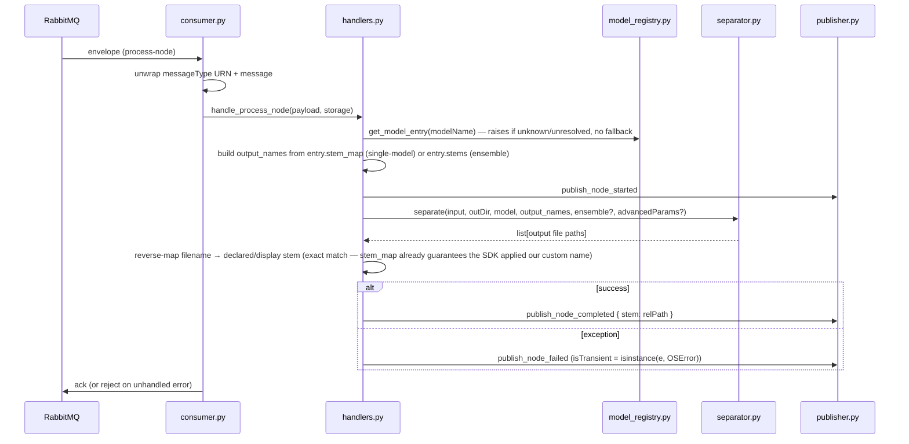
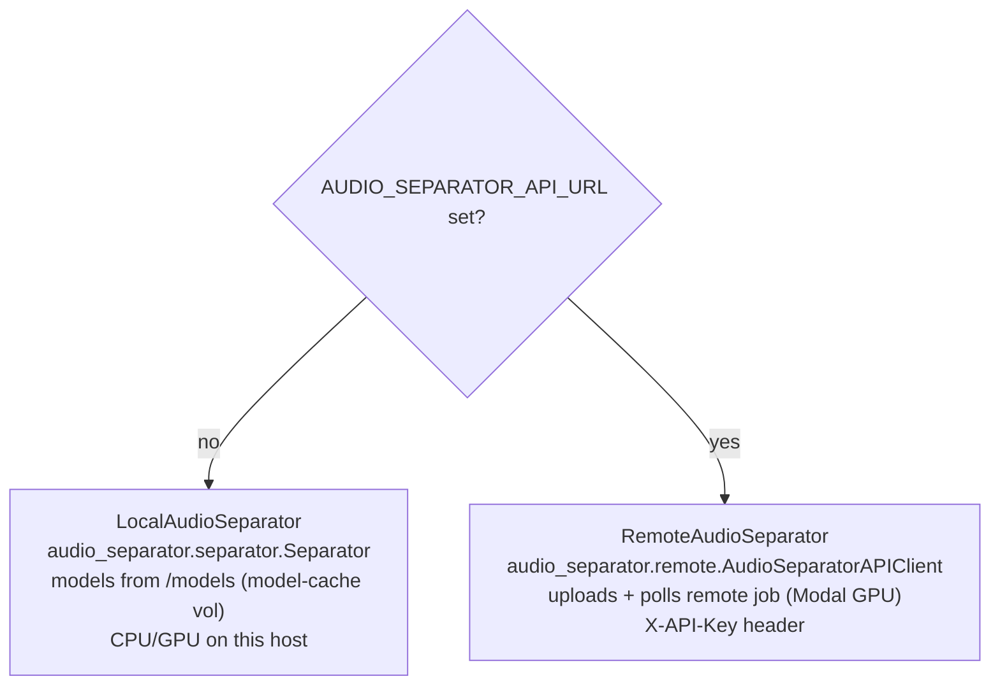

# audio-separation-worker — Python worker

Consumes `ProcessNodeCommand` jobs from RabbitMQ, runs stem separation (locally or via a remote GPU API), and
publishes `NodeStarted` / `NodeCompleted` / `NodeFailed` events back. Python 3.12, kombu,
[`audio-separator`](https://github.com/nomadkaraoke/python-audio-separator).

> The broker topology and message envelope are described in the [root README](../../README.md). This file is
> worker-internal detail.

## Module map



| File | Responsibility |
|---|---|
| `consumer.py` | Binds the `process-node` fanout queue, unwraps the MassTransit envelope, dispatches by message type |
| `handlers.py` | `handle_process_node` → `_handle_audio_separation`: orchestrates registry lookup → start → separate → map → complete |
| `model_registry.py` | `get_model_entry()` — loads `model_registry.json`, the single source of truth for model → `stems` (display) + `stem_map` (display → SDK-real). Raises, no fallback, if a model is missing/unresolved |
| `separator.py` | `AudioSeparator` strategy: `LocalAudioSeparator` vs `RemoteAudioSeparator`, chosen by env |
| `publisher.py` | Builds MassTransit-compatible envelopes and publishes node lifecycle events |
| `validation.py` | `SeparationValidator` — sanity-checks `advancedParams` keys only (model/stem existence is the registry's job) |
| `storage.py` | Relative ↔ absolute path resolution on the shared volume |
| `model_registry.json` | Generated data file: per-model `label`/`category`/`arch`/`stems`/`stem_map`. Built offline by `build_model_registry.py` (in the separate `audio-sep` exploration repo) by actually resolving each model's real SDK-internal stem name(s) |
| `config.py` | Env: `RABBITMQ_*`, `SHARED_DATA_PATH`, `AUDIO_SEPARATOR_MODEL_DIR`, `AUDIO_SEPARATOR_API_URL/KEY` |

## Message handling



- The consumer **acks** after the handler returns and **rejects** on an unhandled exception. The handler itself
  catches separation errors and turns them into a `NodeFailed` event (so a failed node is reported, not dropped).
- **Output naming is deterministic:** `{normalized_declared_stem}_{nodeExecId[:5]}` (spaces/hyphens → `_`,
  lowercased), but keyed by the model's SDK-real stem name (from `model_registry.json`'s `stem_map`) so the SDK
  is guaranteed to apply it — no runtime string-matching/guessing. `configJson.stems` from the front-end is
  ignored entirely; the registry is authoritative.
- **`configJson`** (from the node) drives behavior: `modelName` (required, looked up in the registry — errors
  with no fallback if missing/unresolved), `ensembleEnabled` + `ensembleModels` + `ensembleMethod`, and
  `advancedParams`.

## Local vs remote separation

`create_audio_separator()` returns `RemoteAudioSeparator` iff `AUDIO_SEPARATOR_API_URL` is set, else
`LocalAudioSeparator`.



`advancedParams` are split into the SDK's arch-specific dicts (`mdx_params`, `vr_params`, `demucs_params`,
`mdxc_params`) plus common keys (`output_format`, `sample_rate`, …). For multiple models the SDK runs an
**ensemble** with `ensemble_algorithm` (e.g. `avg_wave`).

## Run

```bash
pip install -r requirements.txt
RABBITMQ_HOST=localhost python -m app.consumer       # needs a running RabbitMQ
```

In Docker the entrypoint runs the consumer with `RABBITMQ_HOST=rabbitmq` and the shared `/data/audio` +
`/models` volumes. (`run_consumer.py` is the container entrypoint; `celery.py`/`tasks.py` are legacy/unused —
the active path is the kombu `consumer.py`.)

## ⚠️ Registry sync

`app/model_registry.json` is the worker's single source of truth for model → stems, generated offline by
actually resolving each model's real SDK-internal stem name(s) (not hand-written). It still needs to be kept in
sync with `src/main-api/.../StemDefinitions.cs` and `src/front/src/lib/models.ts` (display labels/categories),
and regenerated/copied in whenever `models.ts`'s `MODEL_DEFINITIONS` changes (new model, or a stem label
rename) — see `build_model_registry.py` in the separate `audio-sep` exploration repo.
