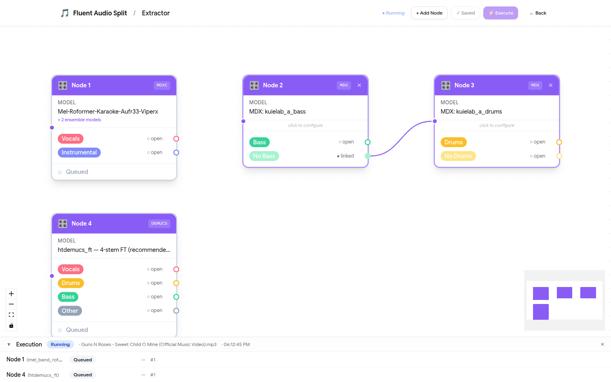
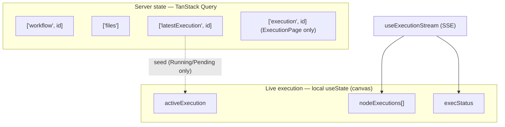
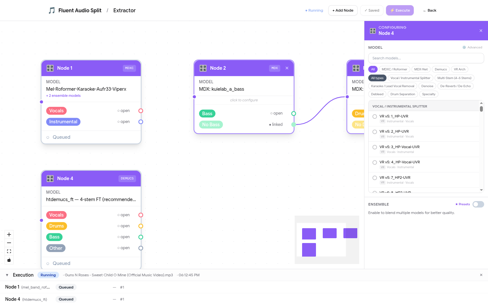
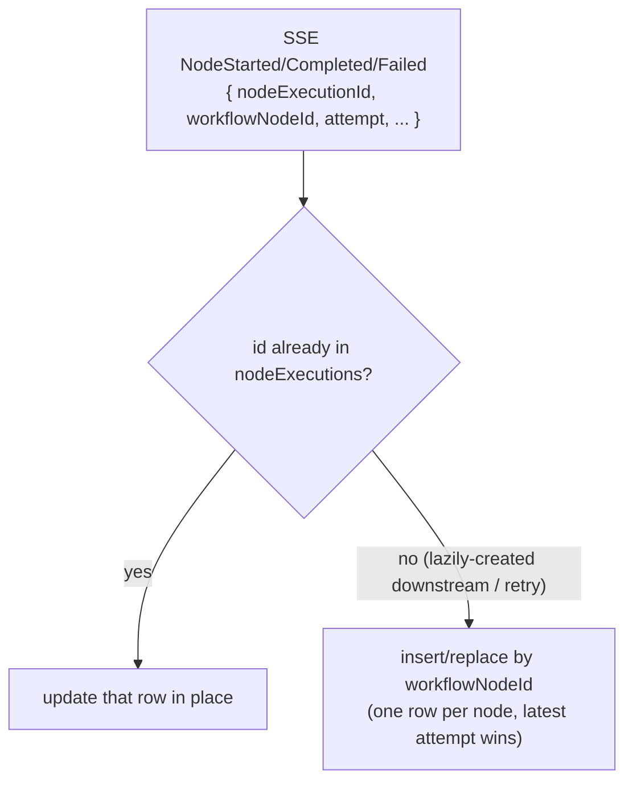

# front — React SPA

The single-page app: auth, file management, the **DAG workflow canvas**, and **real-time execution** rendered
both inline on the canvas and on a standalone execution page. React 19 + TypeScript + Vite, React Flow
(`@xyflow/react`), Tailwind + shadcn/ui, TanStack Query, SSE via `@microsoft/fetch-event-source`.

> System architecture, the execution sequence, and the SSE event contract are in the
> [root README](../../README.md). This file is frontend-internal detail.



## Source layout

```
src/
├── auth/            AuthContext, useAuth, authService (Identity bearer/refresh, localStorage)
├── pages/           route components (see route map in root README)
├── components/
│   ├── AudioSeparationNode.tsx   React Flow node card (+ execution overlay: status border, footer, play/retry)
│   ├── NodeSidePanel.tsx         per-node config drawer (hosts the model browser)
│   ├── workflow/                 ModelBrowser, EnsembleConfig, EnsemblePresetsModal, ParamRow, Tooltip
│   ├── execution/                ExecutionDrawer, NodeExecutionCard, StatusBadge
│   ├── files/                    FileTable, FileUploadZone
│   ├── layout/                   AppHeader
│   └── ui/                       shadcn primitives (button, card, table, …)
├── hooks/           useExecutionStream (SSE), useNowTick (1s ticker for live durations)
├── lib/             models.ts (MODEL_DEFINITIONS + presets), advancedParams.ts, executionState.ts, utils.ts
├── services/        apiClient (axios + bearer interceptor), workflows/executions/files services
└── types/           workflow.ts, execution.ts, file.ts, auth.ts
```

## Data & state model



- **Server data** (workflows, files, executions list) → TanStack Query.
- **Live execution state** on the canvas is **local `useState`**, seeded from the execute response or a running
  `latestExecution`, then updated by SSE. (The standalone `ExecutionPage` is instead driven by the
  `['execution', id]` query.)

## React Flow canvas

- `WorkflowCanvasPage` converts `workflow.nodes` → RF nodes/edges (`toRF`, laid out left→right with **dagre**)
  and back on save (`fromRF`). Edges carry the **stem name** as `sourceHandle`.
- `AudioSeparationNode` renders one output handle per stem (colored via `STEM_COLORS`) plus, during a run, an
  **execution overlay**: status-colored border/pulse, a status footer with elapsed time, and a play/retry button.
- Clicking a node opens `NodeSidePanel` → the **model browser** (`ModelBrowser`): search, architecture filter
  pills (MDXC·Roformer / MDX-Net / Demucs / VR), category pills, ensemble config + community presets, and an
  advanced-params modal.



## Real-time execution

`useExecutionStream` opens `GET /api/executions/{id}/stream` (SSE) and maps backend event `type`s to two
callbacks. `lib/executionState.ts#applyNodeStatusEvent` **upserts** node executions:



This upsert (plus the backend adding `workflowNodeId`/`attempt` to events) is what makes **downstream and
retried nodes** show live status — previously they were dropped because the client only matched by id against a
root-only seed. `useNowTick` re-renders running rows once a second so elapsed timers advance.

> Background and the remaining execution-UX gaps (branched `PartiallyFailed`, version drift, late-subscriber
> resync) are in the root README → Robustness and `../../TODO.md`; design notes in the Serena memory
> `frontend/execution_overlay`.

## Commands

```bash
npm install
npm run dev          # http://localhost:5173 (set VITE_SERVICE_URL=http://localhost:8080 in .env.development)
npm run build        # tsc -b && vite build
npm run lint
npm run storybook    # component playground (stories in src/stories)
```

**Env:** `VITE_SERVICE_URL` (API base; the app appends `/api`). In Docker it's baked at build time to the
gateway origin `http://localhost:8765`. A `http://localhost:5001` fallback in a few services is dead code (dev
uses `:8080`).
