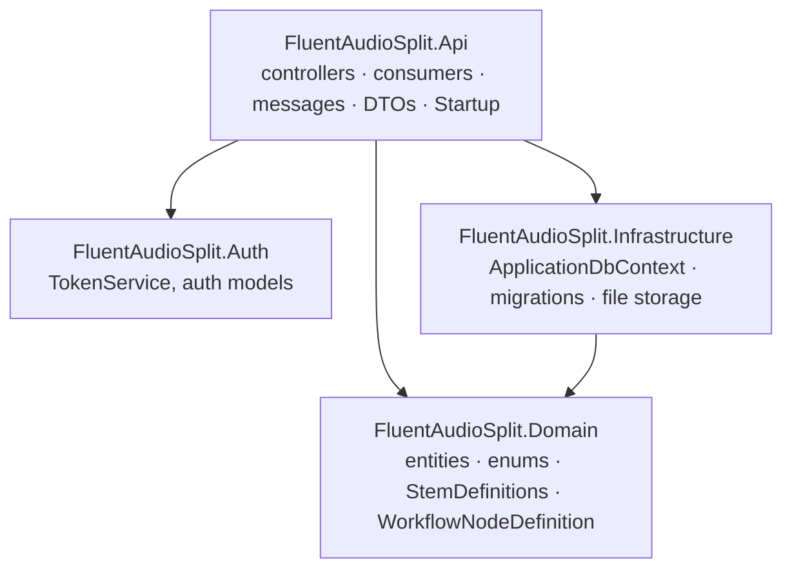
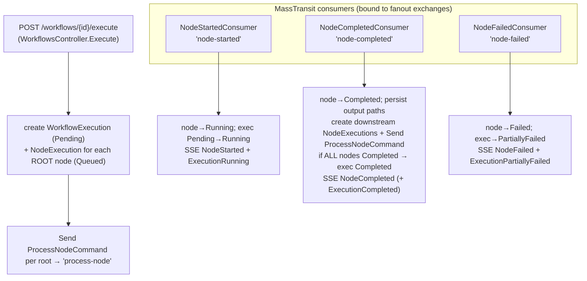

# main-api — ASP.NET Core API

The orchestration brain: REST + SSE for the SPA, the **workflow execution engine**, persistence, and the
RabbitMQ bridge to the Python worker. .NET 10, EF Core (SQLite), ASP.NET Identity, MassTransit.

> System-wide context, the messaging topology, and the end-to-end execution sequence live in the
> [root README](../../README.md). This file is API-internal detail.

## Projects



| Project | Holds |
|---|---|
| `FluentAudioSplit.Api` | `Controllers/`, `Consumers/`, `Messages/`, `Dtos/`, `Services/ExecutionEventBus`, `Startup` |
| `FluentAudioSplit.Domain` | Entities, status enums, `Models/StemDefinitions`, `Models/WorkflowNodeDefinition` |
| `FluentAudioSplit.Infrastructure` | `Persistence/ApplicationDbContext`, EF migrations, `MigrationsService`, `Storage/` |
| `FluentAudioSplit.Auth` | `TokenService` + auth request/response models |

## HTTP pipeline & auth

`Startup.Configure` order: `UseRouting → UseCors("FrontendDev") → UseAuthentication → UseAuthorization →
MapControllers → MapGroup("/api/auth").MapIdentityApi<ApplicationUser>()`.

- **Auth is ASP.NET Identity's built-in API** (`AddIdentityApiEndpoints` + `MapIdentityApi`) — `/api/auth/register`,
  `/login`, `/refresh`, etc. There is **no custom auth controller**. Bearer token TTL 5 min, refresh 14 days.
  Password policy: ≥8 chars, requires a digit, no symbol requirement.
- **CORS** policy `FrontendDev` is wide open (`SetIsOriginAllowed(_ => true)`, any header/method).
- **DB**: `AddDbContextFactory<ApplicationDbContext>` (SQLite). `MigrationsService` (a hosted service) applies
  migrations on startup — no manual `dotnet ef database update` needed in containers.
- `ExecutionEventBus` is a **singleton**; `IFileStorageProvider` → `LocalFileStorageProvider` (base `/data/audio`).

## The execution engine

The engine is **event-driven and stateless across messages** — there is no long-running saga. State lives in the
DB; each consumer reacts to one message, mutates rows, dispatches follow-ups, and re-broadcasts to SSE.



**Important design notes**

- **Lazy node creation.** Only root `NodeExecution` rows are created at execute time. Downstream rows are created
  by `NodeCompletedConsumer` when their parent completes (matching `nodeDef.SourceNodeId == completedWorkflowNodeId`).
  Each gets a fresh `Guid` id.
- **Completion check** is by **distinct `WorkflowNodeId`** (`allNodeIds.All(completedNodeIds.Contains)`), so retry
  attempts (multiple `NodeExecution` rows per node) don't break it.
- **Idempotency:** `NodeCompletedConsumer` early-returns if the node is already `Completed` (guards against
  at-least-once redelivery re-spawning downstream work). No inbox/outbox or DB uniqueness beyond this.
- **Retry** (`ExecutionsController.RetryNode`) only works on a `Failed` node; it inserts a **new** `NodeExecution`
  (`Attempt+1`, `Queued`) and re-sends `ProcessNodeCommand` against the **pinned** version's node def.

### SSE event bus

`ExecutionEventBus` keeps a per-execution list of `Channel<string>` writers. `StreamExecution` adds a writer for
the request and yields `data: {json}\n\n` lines until the client disconnects.

| SSE `type` | Source consumer | Extra fields |
|---|---|---|
| `NodeStarted` | NodeStarted | `nodeExecutionId, workflowNodeId, attempt, status` |
| `NodeCompleted` | NodeCompleted | `nodeExecutionId, workflowNodeId, attempt, outputArtifactPaths` |
| `NodeFailed` | NodeFailed | `nodeExecutionId, workflowNodeId, attempt, errorMessage, isTransient` |
| `ExecutionRunning` / `ExecutionCompleted` / `ExecutionPartiallyFailed` | resp. | `workflowExecutionId` |

> `workflowNodeId`/`attempt` were added so clients can place updates on the right node even for lazily-created
> downstream rows. The bus is **in-memory with no replay** — a late subscriber misses earlier events. There is
> no `ExecutionFailed`/`ExecutionCancelled` event. See root README → Robustness and `../../TODO.md`.

## MassTransit ⇄ Python interop

C# uses MassTransit; Python uses kombu. They agree on **fanout exchanges** named per message and on MassTransit's
JSON envelope (`messageType: ["urn:message:FluentAudioSplit.Api.Messages:<Class>"]`, `message: {...}`).

- `Startup` declares three `ReceiveEndpoint`s (`node-started`, `node-completed`, `node-failed`), each `Bind`ing a
  fanout exchange of the same name.
- The API **sends** `ProcessNodeCommand` to `queue:process-node`; the worker binds a `process-node` fanout
  exchange/queue and unwraps the envelope.

Message contracts (`Messages/`): `ProcessNodeCommand`, `NodeStartedEvent`, `NodeCompletedEvent`, `NodeFailedEvent`.

## Persistence & versioning

- Entities: `ApplicationUser`, `Workflow`, `WorkflowVersion`, `WorkflowExecution`, `NodeExecution`, `FileRecord`
  (ER diagram in the root README).
- The graph is **JSON in `WorkflowVersion.StructureJson`** (`List<WorkflowNodeDefinition>`), not relational rows.
  `Create` makes version 1; `PATCH` always appends a new version (existing node ids preserved, new nodes get fresh
  ids). `Execute` pins `WorkflowVersionId`.
- `NodeExecution.OutputArtifactPathsJson` stores the `{stem → relativePath}` map produced by the worker.

## Run / migrate

```bash
dotnet run --project FluentAudioSplit.Api --launch-profile http     # http://localhost:8080, Swagger at /swagger

# Add a migration after changing entities
dotnet ef migrations add <Name> \
  --project FluentAudioSplit.Infrastructure \
  --startup-project FluentAudioSplit.Api \
  --context ApplicationDbContext
```

Config (env / `appsettings`): `ConnectionStrings__DefaultConnection`, `RabbitMq__Host/Username/Password`,
`FileStorage__BasePath`, `YouTubeAudioImport__DownloaderPath`, `YouTubeAudioImport__JavaScriptRuntimePath`,
`YouTubeAudioImport__CookiesFilePath`, `YouTubeAudioImport__FfmpegPath`, `YouTubeAudioImport__TimeoutSeconds`, and
`YouTubeAudioImport__MaximumFileSizeBytes`.

## YouTube audio imports

`POST /api/files/import-youtube` accepts an authenticated `{ "url": "..." }` request for one YouTube video.
`IYouTubeAudioImportService` validates the URL, invokes `yt-dlp` and `ffmpeg` without a shell, then persists the
resulting MP3 as a normal owned `FileRecord`. The service is deliberately independent of the controller so a future
background queue can call the same import operation while keeping the initial HTTP flow synchronous.

- Accepted URLs are canonical single-video links on `youtube.com` and `youtu.be`; playlists and arbitrary URLs are rejected.
- The API runtime image supplies checksum-verified `yt-dlp` 2026.07.04, `ffmpeg`, and Deno for yt-dlp's required EJS JavaScript runtime. Local API development needs all three commands on `PATH`, or configure their paths; `FfmpegPath` is empty by default so yt-dlp searches `PATH`.
- The API host must have outbound HTTPS access to YouTube and its media/CDN hosts. Do not place a proxy in the path unless egress policy, geographic routing, or rate limiting requires it.
- To address YouTube's VPS “Sign in to confirm you're not a bot” challenge, set `YouTubeAudioImport__CookiesFilePath` to an operator-managed Netscape/Mozilla cookie file. The optional root `docker-compose.youtube-cookies.yml` overlay mounts `secrets/youtube-cookies.txt` at `/run/secrets/youtube-cookies.txt` read-only. Do not accept cookie files from API clients or put them in `appsettings`; protect the host file with mode `600` and rotate it when needed.
- Authentication cookies can still be insufficient when YouTube requires a per-video PO token or rejects the host IP. yt-dlp recommends a PO-token provider plugin in that case; use a dedicated account and keep request volume low to reduce the risk of account restrictions.
- Defaults are five minutes and 1 GiB. Override `YouTubeAudioImport__TimeoutSeconds` or `YouTubeAudioImport__MaximumFileSizeBytes` to suit deployment capacity.
